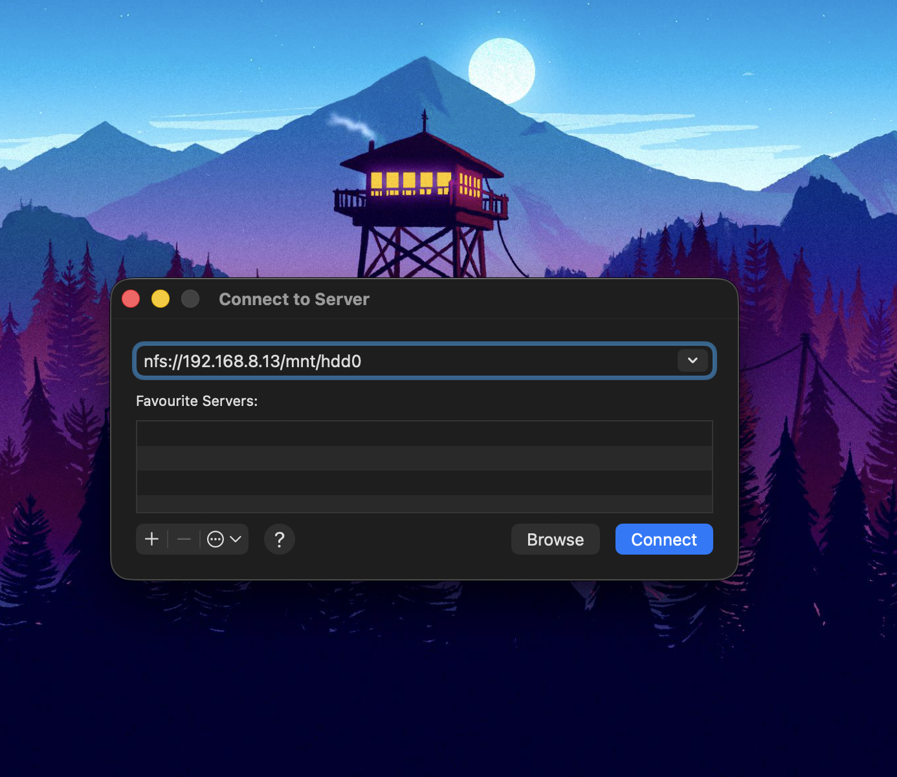
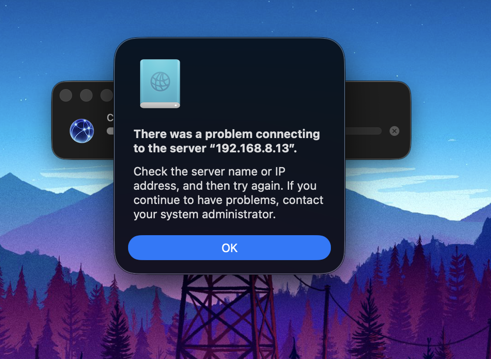
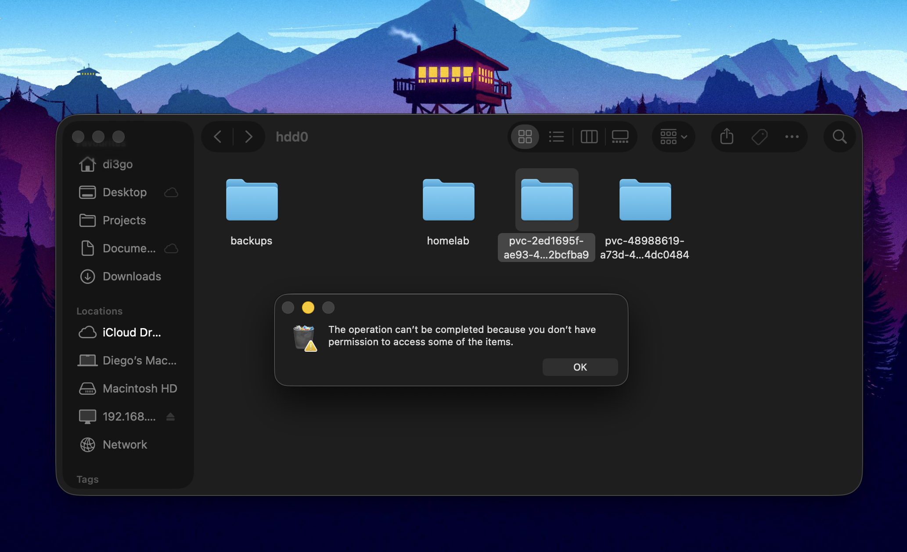
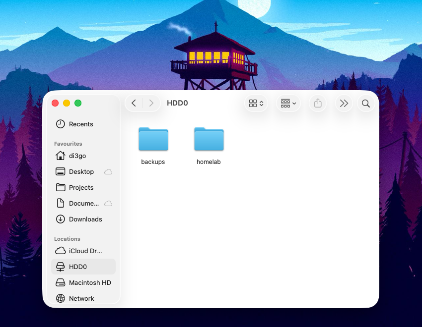

## Introduction

Several Christmases ago, I got a 6TB HDD without a NAS. At first, I thought it was a bummer—so much storage, yet being forced to access it with a rather short USB cable.

At that time, I was just at the beginning of my first university semester in Computer Science. However, within a matter of months, I would learn about network storage and get my hands on a second-hand Raspberry Pi 3.

I regret to say that I never really managed to get it working properly.

First, I tried NFS, as it seemed the more straightforward approach. I made it work, but not really *work*. I never managed to fix the permissions and UIDs, remount it automatically, or have it show up in the Network section, etc.

Then, I tried SMB with [Samba](https://www.samba.org), so that I could make use of network discovery. Again, I made it *somewhat* work, but ended up with a mess of configurations between Docker, SMB versions, and Linux vs. Windows versions. Additionally, I had to prompt a password every time I connected to the machine.

So, I went for [OMV](https://www.openmediavault.org) to have a web interface and sensible defaults. However, dedicating one node only to this always felt off.

Now, after 10 years, I find myself with the same HDD, a Raspberry Pi 5, a fancier mini rack, and a job as a Systems Engineer. So, let's make this work properly!

```zsh
root@pi-delta:~# lsblk
NAME        MAJ:MIN RM  SIZE RO TYPE MOUNTPOINTS
sda           8:0    0  5.5T  0 disk
└─sda1        8:1    0  5.5T  0 part /mnt/hdd0
mmcblk0     179:0    0 59.5G  0 disk
├─mmcblk0p1 179:1    0  128M  0 part /boot/firmware
└─mmcblk0p2 179:2    0 59.4G  0 part /
```

## 1. Configure the export

Let's install NFS and configure the export
```shell
sudo apt install nfs-kernel-server
echo '/mnt/hdd0 *(rw,sync,no_subtree_check,no_root_squash)' > /etc/exports
sudo exportfs -a 
```
Nice, now let's test the connection

Bad luck

This is probably due to macOS trying NFSv4 by default, so we need to force NFSv3.

```zsh
sudo mount_nfs -o vers=3,resvport,rdirplus=0,locallocks 192.168.8.13:/mnt/hdd0 /Volumes/hdd0
```

Forcing NFSv3 works! The next problem is that I now have read-only permissions on this folder.



This issue arises because NFS preserves the UIDs and GIDs, so my UID is (and this is the one used by the file explorer as well):

```zsh
$ id
uid=501(di3go) gid=20(staff)
```

However, the files are owned by either `1000` or `0`:

```zsh
$ ls -ln /Volumes/hdd0
drwxr-sr-x   4 1000  0     4096 Mar 17 23:09 backups
drwxr-xr-x  10 0     0     4096 Mar 16 22:01 homelab
drwxr-xr-x   2 0     0     4096 Mar 17 07:47 pvc-2ed1695f-ae93-4d14-8dbe-220d62bcfba9
drwxr-xr-x   7 1000  1000  4096 Mar 17 07:50 pvc-48988619-a73d-47b2-951c-1d6954dc0484
```
## 2. Fix UID mapping

There are various ways to fix this issue. The easiest one in my case is to mount and map all users to root. This can be done using `all_squash`, which maps all UIDs to `anon`, and then using `anonuid=0,anongid=0` to map `anon` to `root`:

```zsh
/mnt/hdd0 *(rw,sync,no_subtree_check,all_squash,anonuid=0,anongid=0)
```

## 3. Make it accessible

Now, I don't want to run:
```zsh
sudo mount_nfs -o vers=3,resvport,rdirplus=0,locallocks 192.168.8.13:/mnt/hdd0 /Volumes/hdd0
```

Unfortunately, we can't make it discoverable like SMB shares (or well - we could, but macOS only exposes SMB and AFS shares in the Finder sidebar). What we can do instead is set up an automount like this:

```zsh
#!/bin/bash
# Setup NFS automount for macOS
# Run with: sudo ./scripts/setup-nfs-macos.sh
set -e
MOUNT_NAME="HDD0"
NFS_SERVER="192.168.8.13"
NFS_PATH="/mnt/hdd0"
LOCAL_PATH="/Volumes/${MOUNT_NAME}"
echo "Setting up NFS automount for ${NFS_SERVER}:${NFS_PATH}"
# Add to auto_master if not present
if ! grep -q "auto_nfs" /etc/auto_master; then
    echo "/- auto_nfs -nobrowse,nosuid" | tee -a /etc/auto_master
    echo "Added auto_nfs to /etc/auto_master"
fi
# Create auto_nfs with Catalina+/Sonoma path trick
tee /etc/auto_nfs << EOF
/System/Volumes/Data/../Data/Volumes/${MOUNT_NAME} -fstype=nfs,noowners,nolockd,noresvport,hard,bg,intr,rw,tcp,nfc,resvport ${NFS_SERVER}:${NFS_PATH}
EOF
chmod 644 /etc/auto_nfs
echo "Created /etc/auto_nfs"
# Create mount point
mkdir -p "${LOCAL_PATH}"
echo "Created mount point: ${LOCAL_PATH}"
# Reload automount
automount -vc
echo ""
echo "Done! Access the share at: ${LOCAL_PATH}"
echo "Note: After macOS updates, you may need to re-run this script"
```

Then, open it once with `Cmd+Shift+G` by going to `/Volumes/HDD0`, and drag the folder to Locations or Favorites to pin it, and you're done!



Your NFS share will stay in the sidebar and mount on-demand when you click on it 