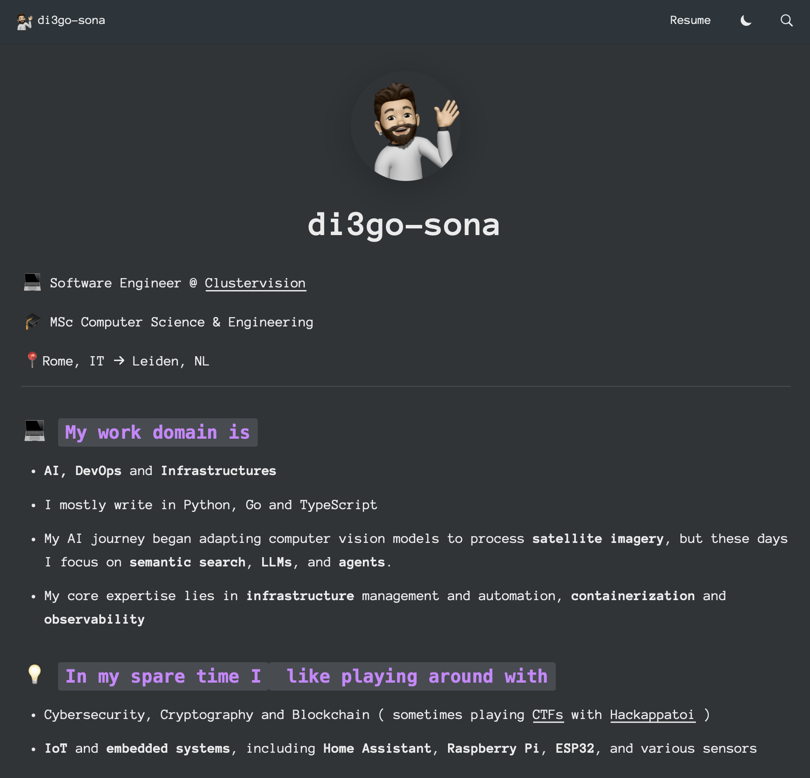

I started blogging around 3 years ago, at that time I was using Notion as my main knowledge tracking tool. It was the new kid around the block and I admit it does work pretty well.

As I am a deep believer of 'less is more', it was a natural decision to use Notion as my blogging platform as well, and I basically had 5 options:

Get the Notion Pro plan and directly build the website using built in functionality
- ✅ PROS: Quick
- 🛑 CONS: Monthly Fee, Limited customization options

Keep the Notion Free plan and use existing services to turn it into a website
  There are lots of services to do this like [Potion.so](https://potion.so) and [Super.so](https://super.so) but basically they all work in the same way
- ✅ PROS:  Quick, Nice designs, cheaper
- 🛑 CONS: Monthly Fee, Limited customization options, another dependency in the pipeline

Do something on my own using open-source components
- ✅ PROS:  Free, Full customization
- 🛑 CONS: Time consuming


In the end I decided to go with the last option, thinking to start small and improve along the way. I used:
- [Notion](https://notion.com) as my articles Database
- [react-notion-x](https://github.com/NotionX/react-notion-x) to Render notion into html 
- [nextjs-notion-starter-kit](https://github.com/transitive-bullshit/https://github.com/transitive-bullshit/nextjs-notion-starter-kit) initial code for the blog server
- [Vercel](https://vercel.com/di3gosonas-projects/blog) to build, deploy and host the website

With minimal tweaks to the initial designed I obtained this nice ( at least for my standard ) result



This worked nice for a few years, until recently Notion has been doing many breaking changes and the mantainer of [react-notion-x](https://github.com/NotionX/react-notion-x) wasn't catching up with that, I realized a section of my website had just disappeared for a rendering error.

I don't want to blame the mantainer, actually the opposite, Travis Fisher made an amazing work with this toolkit that served me well for a few years, but unfortunately having to build a software adapting to an ever changing interface can easily become a rabbit hole.

Additionally the loading speed was good but not excellent as pages were re-fetched and rendered every time.

Thirdly I found it very hard to do small changes into the UI as it's a very complex recursive renderer, in which blocks could contain other blocks, or widgets or inlines

All these limitations made me decide to try and go for another approach. As I am trying to self-host the tools I use, and go for a more minimal and open-source approach for my toolbelt I decided to move fron [Notion](https://notion.com) to [Obsidian](https://obsidian.md).

Now given that [Obsidian](https://obsidian.md) is based on markdown, this allows us to directly use one of the existing markdown renderers that are a lot more sound than the notion ones.
Last time I did a friend website blog I used [Hugo](https://gohugo.io), but having to use `golang` to format html and js code feels quite weird, so this time I decided to go for [Astro](https://astro.build) instead. 

I've never been a NodeJs fan, but I have to admit that the typescript/react suite for web development it's just incredibly superior to anything else.

My toolchain this time looks something like this:
- [Obisidian](https://obsidian.md) as main database for articles
- [Astro](https://astro.com) as renderer from Markdwon to html
- [Multiterm](https://astro.build/themes/details/multiterm/) as initial code for the blog server
- [Cloudflare](https://cloudflare.com) to build, deploy and host the website

And 75 lines of python code that allows me to move content from obsidian to astro content folder with some links.
There were better ways to achieve this for sure, you can use github pipelines, or maybe some notinon plugin, and so on...

But nothing will ever give you the simplicity and customization level that you can achieve with a few lines of python

```python
import re
import os
import shutil
import yaml

OBSIDIAN_VAULT_PATH = "<VAULT_PATH>"
ASTRO_CONTENT_PATH = "<BLOG_PATH>/src/content"
OBSIDIAN_PAGES_PATH = f"{OBSIDIAN_VAULT_PATH}/Pages"
OBSIDIAN_ASSETS_PATH = f"{OBSIDIAN_VAULT_PATH}/Assets"
FOLDERS_MAPPING = {
    f"{OBSIDIAN_PAGES_PATH}/Blog/Articles": f"{ASTRO_CONTENT_PATH}/articles",
    f"{OBSIDIAN_PAGES_PATH}/Blog/Writeups": f"{ASTRO_CONTENT_PATH}/writeups"
}

def list_documents(path):
    return [f for f in os.listdir(path) if os.path.isfile(os.path.join(path, f))]

if __name__ == "__main__":

    for source_folder_path, target_folder_path in FOLDERS_MAPPING.items():

        # Remove the target path if it exists
        if os.path.exists(target_folder_path):
            shutil.rmtree(target_folder_path)

        # Re-create the target path
        os.makedirs(target_folder_path)

        for full_filename in list_documents(source_folder_path):
            filename, extension = os.path.splitext(full_filename)
            target_dirname = filename.lower().replace(' ', '-')

            source_filepath = \
			    os.path.join(source_folder_path, full_filename)
            target_dirpath = \
	            os.path.join(target_folder_path, target_dirname)
            target_filepath = \
	            os.path.join(target_folder_path, target_dirname, 'index.md')

            # Create the target file path
            os.makedirs(target_dirpath)

            with open(source_filepath, 'r') as source_file:

                file_content = source_file.read()

                file_frontmatter_yaml_match = \
	                re.search(r'^---\n(.*?)\n---', file_content, re.DOTALL)
                if file_frontmatter_yaml_match:
                    file_frontmatter = \
	                    yaml.safe_load(file_frontmatter_yaml_match.group(1))
                    new_file_frontmatter = {}
                    new_file_frontmatter['title'] = filename
                    new_file_frontmatter['published'] = \
	                    file_frontmatter['Created']
                    if 'CTF' in file_frontmatter:
                        new_file_frontmatter['ctf'] = \
	                        file_frontmatter['CTF']
                    if 'Tags' in file_frontmatter:
                        new_file_frontmatter['tags'] = \
						[f.replace('#', '') for f in file_frontmatter['Tags']]
                    if 'tags' in file_frontmatter:
                        new_file_frontmatter['tags'] = \
	                    [f.replace('#', '') for f in file_frontmatter['tags']]


                    new_file_frontmatter_yaml = \
	                    f"---\n{yaml.dump(new_file_frontmatter)}\n---\n"
                    file_content = \
	                file_content.replace(file_frontmatter_yaml_match.group(0),
	                     new_file_frontmatter_yaml,1)

                else:
                    raise ValueError(\
                    f"Frontmatter not found in {source_filepath}")

                attachment_matches = re.finditer(
								                r'[!]\[\[(.*?)([|](.*?))?\]\]',
									            file_content)
                for attachment_match in attachment_matches:
                    attachment_name = attachment_match.group(1)
                    source_attachment_path = os.path.join(
									                    OBSIDIAN_ASSETS_PATH, 
									                    attachment_name)
                    target_attachment_path = os.path.join(
									                    target_dirpath, 
									                    attachment_name)
                    shutil.copyfile(
				                    source_attachment_path,
				                    target_attachment_path)

                    file_content = file_content.replace(
	                    attachment_match.group(0), 
						f''
						)

                with open(target_filepath, 'w') as target_file:
                    target_file.write(file_content)

```

The new result you can see from yourself

I have to admit that I really like it, it's blazingly fast and fully customizable., let's hope it will stand the trial of time