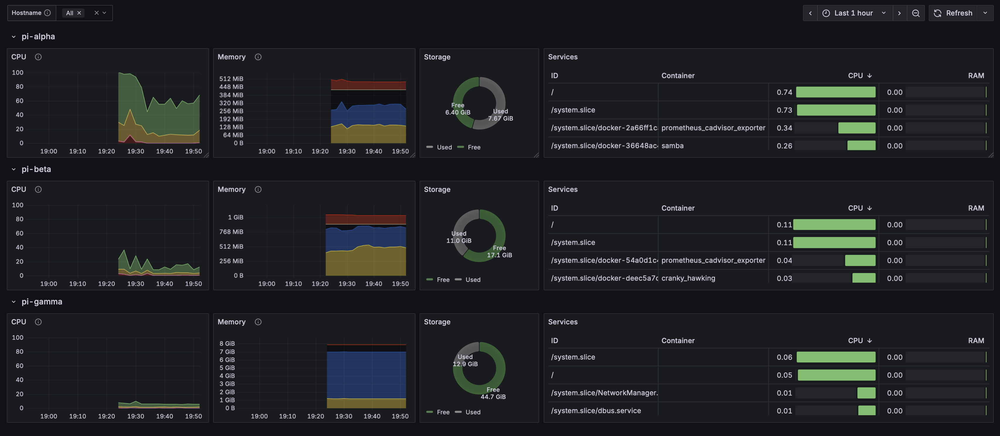

Since I started my career in Computer Science I always had an attraction towards dashboards and monitoring systems, it always gave me a sense of order and control. I’ve been lurking in the shadows of [r/homelab](https://www.reddit.com/r/homelab/) and [r/minilab](https://www.reddit.com/r/minilab/) for quite a while now, waiting to have enough cash to build my shiny personal homelab.

This until I decided to stop procrastinating and let’s start doing, so I just decided to buy a 10 inch rack to store all my hardware in a single place

## Hardware

I already had a few Raspberry Pi’s laying around, a pocket router and a repeater.
Maybe it was already enough to get started, but I decided to buy a new 8GB Ram Pi 5 to have a bit more computational power ( honestly I just wanted one to try it out )

Then I bought a 10” rack and some trays and I 3d printed an assembly for the Raspberries with sliding trays to easily slide the PIs in and out

you might think this is isn’t much computing power anyways but

1. The latest Pi is actually a surprising beast
2. Even if it’s hard to believe, girlfriends aren’t a fan of homelabs, and this is going to be right next to our WFO office, therefore it **had** to be quiet !
### Bill Of Materials

| #   | Name                                                                                                                                                                                                               | Source | Price |
| --- | ------------------------------------------------------------------------------------------------------------------------------------------------------------------------------------------------------------------ | ------ | ----- |
| 1   | [Digitus DN-10-12U-B rack](https://www.dustin.nl/product/5011232261/dn-10-12u-b-rack-wandrek-zwart)                                                                                                                | 💰     | 73    |
| 2   | [Digitus HE Shelf 1U](https://www.amazon.nl/-/en/dp/B08T1TTQQC?ref_=ppx_hzod_title_dt_b_fed_asin_title_0_0&th=1)                                                                                                   | 💰     | 12    |
| 1   | [Digitus 4-way power strip 1U](https://www.amazon.nl/-/en/dp/B09M6W23ZM?ref_=ppx_hzod_title_dt_b_fed_asin_title_0_3&th=1)                                                                                          | 💰     | 20    |
| 1   | [Netgear GS308-300PES](https://www.amazon.nl/-/en/dp/B07PTTX7MX?ref_=ppx_hzod_title_dt_b_fed_asin_title_0_2&th=1)                                                                                                  | 💰     | 24    |
| 1   | iNet GL-AR750S                                                                                                                                                                                                     | ♻️     |       |
| 1   | [Raspberry Pi 5 8GB](https://www.amazon.nl/-/en/dp/B0CK2FCG1K?ref_=ppx_hzod_title_dt_b_fed_asin_title_0_1) + [Heatsink](https://www.amazon.nl/-/en/dp/B0CNVDF2MC?ref_=ppx_hzod_title_dt_b_fed_asin_title_0_4&th=1) | 💰     | 105   |
| 1   | Raspberry Pi 3b 1GB                                                                                                                                                                                                | ♻️     |       |
| 1   | Raspberry Pi 1b 512MB                                                                                                                                                                                              | ♻️     |       |
| 1   | [Renoga 50W 8 USB charger](https://www.amazon.it/dp/B0DDKY8S55?ref_=pe_24968671_487309461_302_E_DDE_dt_1&th=1)                                                                                                     | 💰     | 18    |
| 3   | [L-Shaped USB-C cable](https://www.amazon.it/dp/B092KF36T6?ref_=pe_24968671_487309461_302_E_DDE_dt_1&th=1)                                                                                                         | 💰     | 9     |
| 5   | Ethernet Jumper Cable                                                                                                                                                                                              | 💰     | 10    |
| 1   | Ethernet Cable                                                                                                                                                                                                     | ♻️     |       |
| 1   | [Raspberry Pi Rack Mount](https://www.thingiverse.com/thing:4756812)                                                                                                                                               | 🖨️    |       |
| 4   | M10x50mm Screws                                                                                                                                                                                                    | 💰     | 5     |
| 4   | [M10 knobs](https://makerworld.com/en/models/748617-knob-for-metric-screw-m5-to-m12?from=search#profileId-681972)                                                                                                  | 🖨️    |       |
Sources:
- ♻️ Recycled
- 💰 Purchased
- 🖨️ 3D Printed
## Logical view

The GL.iNet router will be the gateway of the network, also supporting VPN for accessing the homelab when out of home and possibly allowing to mount an external drive to it.

The access point for the house wifi is attached directly to the router, given that it has 2 LAN and 1 WAN ports.

The other LAN port is wired to a gigabit switch that connects the PIs, optionally Samba can be deployed on the PIs to attach additional drives

## Philosophy

Given that i’ve played around with raspberry PI several time and I had them wore in a broken rather than functional state, just to lose interest and leave them lying around I decided that the setup this time should be as reproducible and self-healing as possible.

In order to achieve it I thought what better than use two technologies I am familiar with and I really like: `Docker` and `Ansible` and store all the code in [github](https://github.com/di3go-sona/homelab/tree/main).

The idea is quite easy, use ansible to configure the basic infrastructure, when possible use `Dockerfile` and `docker-compose.yml` files to ensure portability of services

- update packages and prepare the os 
- setup network and mounts
- download and setup docker

For what concern the services I wanted to configure

- Storage ( samba, transmission )
- Monitoring ( grafana, prometheus, exporters )
- Home Automation ( homeassistant )

## Results

In the end I managed to get my new homelab running and it looks pretty cool, would I recommend it to someone else ? 

Absolutely not

I thought to make this article around the lines of 'hey look how cool my homelab setup is' but it would definetely work out better as a post-mortem:

1. I really wanted to use my Pi 1b in this homelab so that I don't waste any of my available hardware. Well.. if you, like me, ever had the same feeling, please just trust me, don't do it:
	- It has `armv6` CPU, good luck finding any pre-compiled binary and/or container that runs on top of it,  I had to make Dockerfiles to recompile `node_exporter` and `cadvisor` to be able to run them there
	- Once I had those two monitoring container running I was out of clock cycles, not that I was looking to run a Minecraft server on it, but at least a samba and transmission container. I therefore had to crank scrape time down to 60s in order to run at least transmission on it
	- Finally, any Ansible task will just take forever, building a docker container or updating `apt` can easily take 15 minutes.. Basically increasing the total runtime of any ansible playbook tenfold.

2. `Ansible` and `Docker Compose` are not really meant to run together, or at least not to use the first to run the latter, there are only 4 tasks in the docker-compose 
	- [docker_compose_v2 module](https://docs.ansible.com/ansible/latest/collections/community/docker/docker_compose_v2_module.html#ansible-collections-community-docker-docker-compose-v2-module) – Manage multi-container Docker applications with Docker Compose CLI plugin
	- [docker_compose_v2_exec module](https://docs.ansible.com/ansible/latest/collections/community/docker/docker_compose_v2_exec_module.html#ansible-collections-community-docker-docker-compose-v2-exec-module) – Run command in a container of a Compose service
	- [docker_compose_v2_pull module](https://docs.ansible.com/ansible/latest/collections/community/docker/docker_compose_v2_pull_module.html#ansible-collections-community-docker-docker-compose-v2-pull-module) – Pull a Docker compose project
	- [docker_compose_v2_run module](https://docs.ansible.com/ansible/latest/collections/community/docker/docker_compose_v2_run_module.html#ansible-collections-community-docker-docker-compose-v2-run-module) – Run command in a new container of a Compose service
	
		3 out of 4 of those modules are basically useless for our us, leaving us to do everything trough the [docker_compose_v2 module](https://docs.ansible.com/ansible/latest/collections/community/docker/docker_compose_v2_module.html#ansible-collections-community-docker-docker-compose-v2-module) , that doesn't even provide an easy way to rebuild and restart on code change, driving me to write a lot of complex json querying to extract meaningful information of what to restart like 
		`"{{ docker_compose_output.actions | map(attribute='id') | list | first }}"` and check if those are running after restart `container_info.container.State.Status != "running"`.
	Would have probably been better to use the docker modules to build and run the containers 

3. Data and backups: This is an interesting part as well, I had a spare SSD lying around and I tried to plug it directly into the Pi1 or the router, but it would make the internet stutter and rpi restart. 
   Probably it was drawing too much power and all the other devices connected to the same power supply started becoming flaky

4. Services, routing and HA. Well the issue is quite simple here, having different dockers running on separate devices means that you will have to connect to individual hostnames and ports to reach a certain service, no failover, no easily manageable services, in the beginning I thought it would be fun to start reimplementing some service discovery and load balancing, basically rebuilding some kubernetes components in my homelab.
   The more I progressed into it
### Improvements and new iteration

- Turn the docker cluster into a kubernetes one
- Add 2 more Pi5 to the kubernetes cluster and remove the Pi1 from ansible/kubernetes. We can use it for hardware management tasks such as
	- Netboot server
	- Power management of the other Pis
	- Connect to UART shell of other Pis
	- Manage lights in the rack ? 
