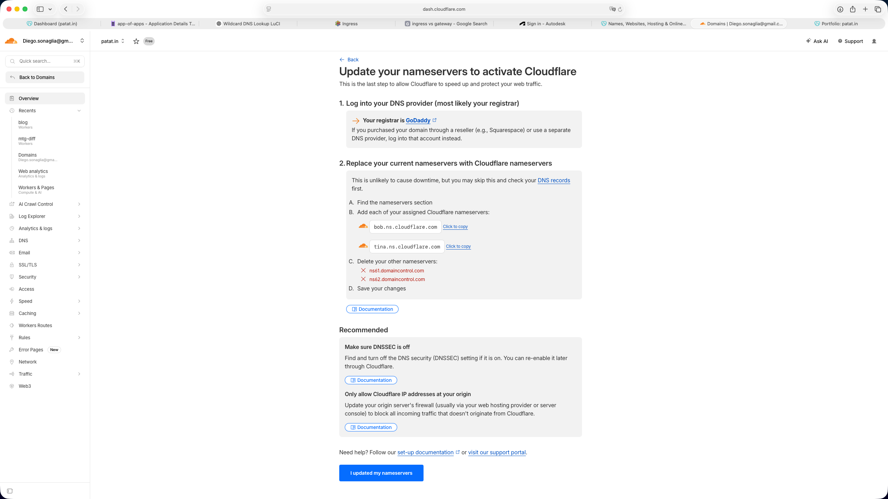
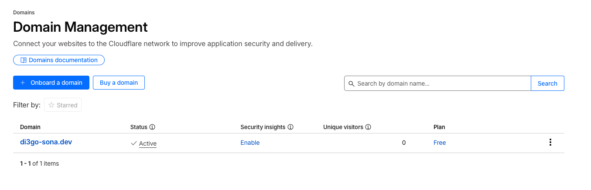
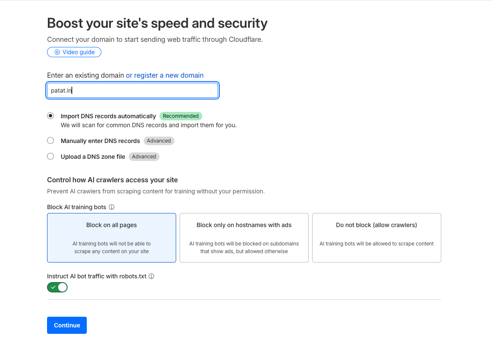
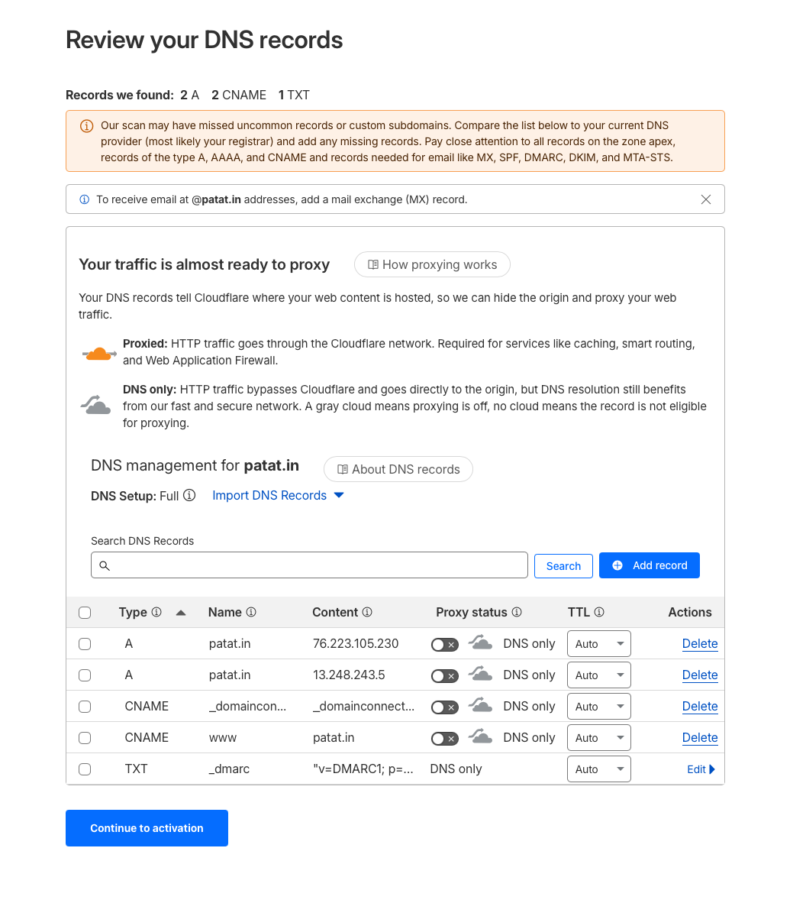
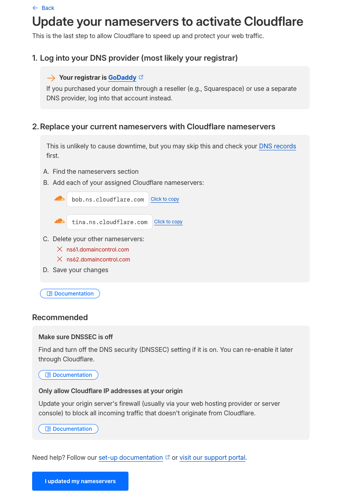

In the [previous article](https://di3go.sona.dev/blog/my-kubernetes-homelab) we went through the process of setting up a k0s cluster on a bunch of Raspberry Pis.

At the end of that article the cluster was up and running, but we had no way of actually accessing our services from the outside. In this article we'll fix that by setting up local DNS, TLS certificates and a proper ingress.

The goal is simple: I want to type `argo.patat.in` in my browser and get my ArgoCD dashboard, with a valid TLS certificate, without any port forwarding or VPN shenanigans.

## The problem

If you recall from the previous article, Cilium is configured with an ingress controller in shared load-balancer mode, pinned to IP `192.168.8.20` via LBIPAM.

This means that all HTTP/HTTPS traffic to the cluster flows through that single IP, and Cilium takes care of routing it to the right service based on the Host header.

What we're missing is:
- **DNS**: something that maps `*.patat.in` to `192.168.8.20` so that devices on the LAN can reach the ingress
- **TLS**: valid certificates so that browsers don't scream at us
- **A way to distribute the TLS secret** to all the namespaces where we have Ingress resources

## Cilium ingress controller

In the previous article we installed Cilium as our CNI, but we also configured it to act as an ingress controller and L2 load balancer. Let me quickly recap the relevant parts.

```yaml
apiVersion: argoproj.io/v1alpha1
kind: Application
metadata:
  name: cilium
  namespace: argocd
  annotations:
    argocd.argoproj.io/sync-wave: "-3"
spec:
  project: default
  sources:
    - repoURL: https://helm.cilium.io/
      chart: cilium
      targetRevision: 1.15.5
      helm:
        parameters:
          - name: kubeProxyReplacement
            value: "true"
          - name: k8sServiceHost
            value: "192.168.8.15"
          - name: k8sServicePort
            value: "6443"
          - name: l2announcements.enabled
            value: "true"
          - name: l2announcements.leaseDuration
            value: 3s
          - name: l2announcements.renewDeadline
            value: 1s
          - name: l2announcements.retryPeriod
            value: 200ms
          - name: externalIPs.enabled
            value: "true"
          - name: ingressController.enabled
            value: "true"
          - name: ingressController.loadbalancerMode
            value: shared
          - name: ingressController.service.annotations.lbipam\.cilium\.io/ips
            value: "192.168.8.20"
          - name: cni.exclusive
            value: "false"
    - repoURL: https://github.com/di3go-sona/homelab.git
      targetRevision: main
      path: src/argo/apps/cilium/resources
  destination:
    server: https://kubernetes.default.svc
    namespace: cilium
  ignoreDifferences:
    - kind: Secret
      name: cilium-ca
      jsonPointers:
        - /data
    - kind: Secret
      name: hubble-server-certs
      jsonPointers:
        - /data
    - kind: Service
      name: cilium-ingress
      jqPathExpressions:
        - .spec.ports[].nodePort
  syncPolicy:
    syncOptions:
      - CreateNamespace=true
```

The key parameters here are:
- `ingressController.enabled: true` turns on Cilium's built-in ingress controller, so we don't need nginx-ingress or traefik
- `ingressController.loadbalancerMode: shared` means all Ingress resources share a single LoadBalancer Service instead of getting one each, which is much lighter on resources
- `ingressController.service.annotations.lbipam...: "192.168.8.20"` pins the shared LoadBalancer to a specific IP via LBIPAM
- `l2announcements.enabled: true` makes LoadBalancer IPs ARP-visible on the LAN, so devices can reach `192.168.8.20` without any manual ARP configuration
- `cni.exclusive: false` allows Multus to coexist with Cilium (more on that later)

Then we need two more resources to define the IP pool and the L2 announcement policy:

```yaml
apiVersion: "cilium.io/v2alpha1"
kind: CiliumLoadBalancerIPPool
metadata:
  name: services-pool
  annotations:
    argocd.argoproj.io/sync-wave: "1"
spec:
  blocks:
    - start: "192.168.8.20"
      stop: "192.168.8.29"
---
apiVersion: "cilium.io/v2alpha1"
kind: CiliumL2AnnouncementPolicy
metadata:
  name: default-policy
  annotations:
    argocd.argoproj.io/sync-wave: "1"
spec:
  loadBalancerIPs: true
  interfaces:
    - eth0
```

The `CiliumLoadBalancerIPPool` defines the range of IPs that can be assigned to LoadBalancer services (`192.168.8.20` through `192.168.8.29`), and the `CiliumL2AnnouncementPolicy` tells Cilium to announce those IPs via ARP/NDP on `eth0`.

The result is that `192.168.8.20` is now a reachable IP on the LAN, and any traffic hitting it gets routed by Cilium's ingress controller based on the Host header.

## Local DNS with dnsmasq

The first thing we need is local DNS resolution. I run a GL.iNet router that comes with dnsmasq pre-installed, which makes this quite straightforward.

The idea is to create a split DNS configuration:
- `_acme-challenge` requests for `patat.in` go to Cloudflare (so that Let's Encrypt can validate DNS-01 challenges)
- everything else for `patat.in` goes to the local ingress IP

```conf
#/etc/dnsmasq.conf
server=/_acme-challenge.patat.in/1.1.1.1
server=/_acme-challenge.patat.in/1.0.0.1
address=/patat.in/192.168.8.20
address=/.patat.in/192.168.8.20
```

The first two lines tell dnsmasq to forward DNS queries for `_acme-challenge.patat.in` to Cloudflare's resolvers (1.1.1.1 and 1.0.0.1). This is important because when cert-manager creates a TXT record in Cloudflare for the DNS-01 challenge, it needs to be able to verify it, and if our local DNS would just return `192.168.8.20` for everything the challenge would fail.

The last two lines map `patat.in` and any subdomain to `192.168.8.20`, which is our Cilium ingress IP.

```bash
/etc/init.d/dnsmasq restart
```

Let's verify it works

```
dig patat.in

; <<>> DiG 9.10.6 <<>> patat.in
;; global options: +cmd
;; Got answer:
;; ->>HEADER<<- opcode: QUERY, status: NOERROR, id: 64433
;; flags: qr aa rd ra; QUERY: 1, ANSWER: 1, AUTHORITY: 0, ADDITIONAL: 1

;; OPT PSEUDOSECTION:
; EDNS: version: 0, flags:; udp: 4096
;; QUESTION SECTION:
;patat.in.			IN	A

;; ANSWER SECTION:
patat.in.		0	IN	A	192.168.8.10

;; Query time: 5 msec
;; SERVER: 192.168.8.1#53(192.168.8.1)
;; WHEN: Sun Mar 15 11:44:28 CET 2026
;; MSG SIZE  rcvd: 53
```

Now any device on the LAN that uses the router as DNS resolver will get `192.168.8.20` for `*.patat.in`.

## Cloudflare configuration

For TLS certificates we'll use Let's Encrypt, but since our ingress is on a private IP and not reachable from the internet, we can't use HTTP-01 challenges. Instead we'll use DNS-01 challenges with Cloudflare as our DNS provider.

The domain `patat.in` is managed in Cloudflare, and we need to create an API token that cert-manager can use to create TXT records for the `_acme-challenge` subdomain.











The token needs `Zone:DNS:Edit` permissions on the zone for `patat.in`.

Once we have the token, we create a Kubernetes secret in the `cert-manager` namespace:

```yaml
apiVersion: v1
kind: Secret
metadata:
  name: cloudflare-api-token
  namespace: cert-manager
type: Opaque
stringData:
  api-token: CLOUDFLARE_TOKEN
```

## cert-manager

Now we can install cert-manager via ArgoCD.

```yaml
apiVersion: argoproj.io/v1alpha1
kind: Application
metadata:
  name: cert-manager
  namespace: argocd
  annotations:
    argocd.argoproj.io/sync-wave: "-2"
spec:
  project: default
  sources:
    - repoURL: https://charts.jetstack.io/
      chart: cert-manager
      targetRevision: v1.15.1
      helm:
        parameters:
          - name: installCRDs
            value: "true"
          - name: extraArgs[0]
            value: --dns01-recursive-nameservers=192.168.8.1:53
          - name: extraArgs[1]
            value: --dns01-recursive-nameservers-only=true
    - repoURL: https://github.com/di3go-sona/homelab.git
      targetRevision: main
      path: src/argo/apps/cert-manager/resources
  destination:
    server: https://kubernetes.default.svc
    namespace: cert-manager
  syncPolicy:
    syncOptions:
      - CreateNamespace=true
```

There are two important things to note here:
- `installCRDs: true` so that cert-manager CRDs (ClusterIssuer, Certificate, etc.) are installed automatically
- `--dns01-recursive-nameservers=192.168.8.1:53` and `--dns01-recursive-nameservers-only=true` tell cert-manager to use the router as the DNS resolver when validating DNS-01 challenges. This is needed because cert-manager needs to check that the TXT record it created in Cloudflare is actually visible before telling Let's Encrypt to proceed with the verification.

And create a certificate issuer, in our case a ClusterIssuer as we don't really want to isolate certificates per namespace

```yaml
apiVersion: cert-manager.io/v1
kind: ClusterIssuer
metadata:
  name: letsencrypt-staging
spec:
  acme:
    server: https://acme-staging-v02.api.letsencrypt.org/directory
    email: di3go.sona@gmail.com
    privateKeySecretRef:
      name: letsencrypt-staging
    solvers:
      - dns01:
          cloudflare:
            apiTokenSecretRef:
              name: cloudflare-api-token
              key: api-token
---
apiVersion: cert-manager.io/v1
kind: ClusterIssuer
metadata:
  name: letsencrypt-production
spec:
  acme:
    server: https://acme-v02.api.letsencrypt.org/directory
    email: di3go.sona@gmail.com
    privateKeySecretRef:
      name: letsencrypt-production
    solvers:
      - dns01:
          cloudflare:
            apiTokenSecretRef:
              name: cloudflare-api-token
              key: api-token
```

I keep both a staging and a production issuer. The staging one is useful for testing without hitting Let's Encrypt's rate limits, once everything works you can switch to the production one.

## Wildcard certificate + Reflector

Instead of creating a certificate per ingress, I opted for a single wildcard certificate for `*.patat.in`. This way every service gets a valid TLS certificate for free, and I don't have to deal with per-namespace certificate management.

```yaml
apiVersion: cert-manager.io/v1
kind: Certificate
metadata:
  name: wildcard-patat-in
  namespace: cert-manager
spec:
  secretName: wildcard-patat-in-tls
  dnsNames:
    - patat.in
    - '*.patat.in'
  issuerRef:
    name: letsencrypt-production
    kind: ClusterIssuer
  secretTemplate:
    annotations:
      reflector.v1.k8s.emberstack.com/reflection-allowed: "true"
      reflector.v1.k8s.emberstack.com/reflection-allowed-namespaces: "argocd,dashy,media,homeassistant,esphome"
      reflector.v1.k8s.emberstack.com/reflection-auto-enabled: "true"
```

The certificate is created in the `cert-manager` namespace, but Ingress resources live in their own namespaces (e.g. `argocd`, `media`, etc.), so we need a way to copy the TLS secret across namespaces.

This is where [Reflector](https://github.com/emberstack/kubernetes-reflector) comes in. The annotations in the `secretTemplate` tell Reflector to automatically mirror the `wildcard-patat-in-tls` secret into the listed namespaces, so that every Ingress can reference it without needing its own certificate.

```yaml
apiVersion: argoproj.io/v1alpha1
kind: Application
metadata:
  name: reflector
  namespace: argocd
  annotations:
    argocd.argoproj.io/sync-wave: "-2"
spec:
  project: default
  sources:
    - repoURL: https://emberstack.github.io/helm-charts
      chart: reflector
      targetRevision: 9.1.18
  destination:
    server: https://kubernetes.default.svc
    namespace: reflector
  syncPolicy:
    syncOptions:
      - CreateNamespace=true
```

Simple and clean, Reflector is just a Helm chart install with no custom configuration needed.

## The Ingress pattern

Now that everything is in place, creating a new ingress for a service is trivial. Here is the Ingress for ArgoCD:

```yaml
apiVersion: networking.k8s.io/v1
kind: Ingress
metadata:
  name: argocd
  namespace: argocd
  annotations:
    ingress.cilium.io/force-https: "disabled"
spec:
  ingressClassName: cilium
  tls:
    - hosts:
        - argo.patat.in
      secretName: wildcard-patat-in-tls
  rules:
    - host: argo.patat.in
      http:
        paths:
          - path: /
            pathType: Prefix
            backend:
              service:
                name: argocd-server
                port:
                  number: 80
```

That's it. The pattern is always the same:
- `ingressClassName: cilium` to use Cilium's ingress controller
- `tls.secretName: wildcard-patat-in-tls` to use the reflected wildcard certificate
- `host: <app>.patat.in` for the routing rule

Every service follows this pattern, `argo.patat.in`, `jellyfin.patat.in`, `homeassistant.patat.in` and so on, all routed through the same Cilium LoadBalancer at `192.168.8.20`, all with valid TLS certificates.

## Conclusion

The full networking stack looks like this:

1. **dnsmasq** on the router maps `*.patat.in` to `192.168.8.20` (and routes `_acme-challenge` to Cloudflare)
2. **Cilium** L2 announcements make `192.168.8.20` ARP-visible on the LAN
3. **Cilium** ingress controller routes traffic based on the Host header to the right service
4. **cert-manager** obtains a wildcard certificate from Let's Encrypt via Cloudflare DNS-01
5. **Reflector** mirrors the TLS secret to every namespace that needs it

All of this is managed declaratively via ArgoCD, the full configuration is available on [GitHub](https://github.com/di3go-sona/homelab).
