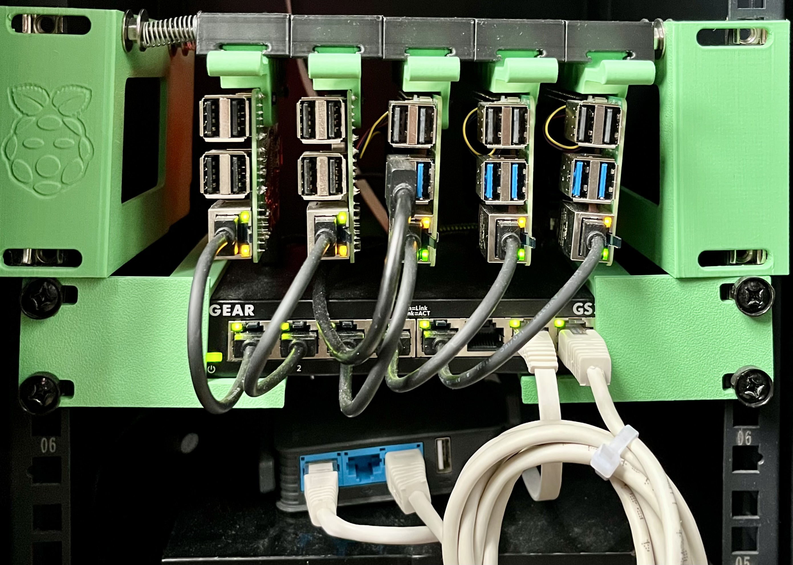
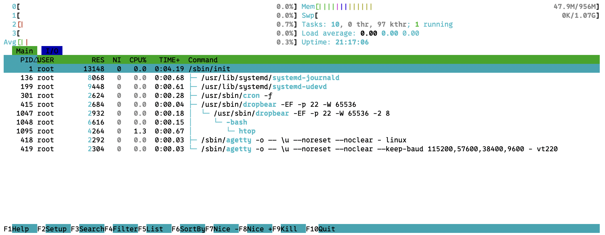
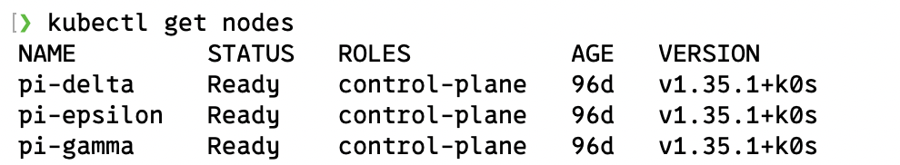
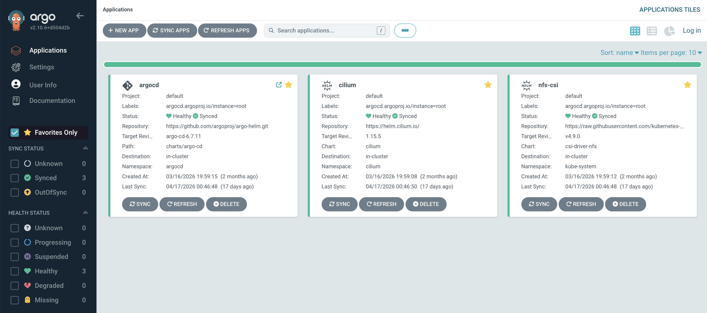

*A* while ago I tried to setup my kubernetes Homelab based on docker [My Homelab setup](/blog/my-homelab-setup), it was an interesting journey for sure but there were too many issues. 

In particular, I really wanted to throw Kubernetes into the mix, both as a learning experience and because its orchestration layer makes sense even outside the cloud native environment.

Even if k8s has a somewhat steeper learning curve, I still think it is worth the extra effort for all the nice features you get out of the box.

The RPi5 makes an exceptional candidate for a Kubernetes cluster node, but I didn't want to run everything on a single node. It would defeat the learning experience and limit the number of services I could run, so I decided to get two more.



So now the first step would be deciding an OS. 

The first time I opted for [Raspberry Pi OS](https://www.raspberrypi.com/software/operating-systems/), mostly out of laziness, it is a solid alternative and it always works

This time I looked around a bit more, someone mentioned to me [HomelabOS](https://homelabos.com) and for a moment I thought about [Flatcar](https://www.flatcar.org) but, the first comes with way too many services, whereas for the latter I am not a big fan of using immutable operating systems for home and personal use

Given my appreciation for minimalism I fell in love with [DietPi](https://dietpi.com) as it comes bundled with absolutely nothing, here is how it looks out of the box. It doesn't even have an ntp daemon! 

Also given that I have 5 SD cards to flash with some settings to customize I ended up [Writing my own RPi image flasher](/blog/writing-my-own-rpi-image-flasher).

The last decision is about which kubernetes distro to use, my top 3 contenders would be:
- vanilla k8s with `kubeadm` or `kubespray` to deploy them
- `k3s`
- `k0s`

Now `kubeadm` is an interesting option for an homelab, but the idea of having to manage all the components individually with mimimal helpers was a bit overwhelming and I was a bit concerned about performance as well/
Second option was  `k3s`, it is super-easy to setup and works great out of the box.
It is actually the first kubernetes distro I ever used and I now have and love-and-hate relatioship with it
- it uses sqlite instead of etcd as a default with a `kine` translation layer in between
- it bundles internal components trough helm and an helm operator
- has an _horrendous_ option to manage helm charts from the OS, I still don't know why anyone would want to do it. You have a fully distributed and replicated databases and then you manage charts from one node. what if you put the same chart in two different nodes ? what if you have to replace one ? it just doesn't make any sense
- it feels somewhat bloated and too custom compared to upstream k8s
On the upside it comes with a nice ansible playbook for deployment it and an amazing 'cluster-reset' feature to reinitialize a broken cluster without losing the existing data
The last option is `k0s`, according to the internet it should be resource 'heavier' compared to `k3s` but I didn't really notice, and I think the setup is a lot more straightforward. It comes with `k0sctl` that is an amazing tool to bootstrap a cluster ( a bit less to mantain it), the feeling in general is that is more standard and less 'bloated' than `k3s`
Finally also `k0s` has some pitfalls, the main ones are
- the `k0s` binary starts both `etcd` and `kube-api` at the same time, now the problem is that if there is something wrong with any of the two the cluster will enter in a crashloop and is quite hard to troubleshoot. I actually managed to restore a broken `etcd` cluster by stopping the cluster and using the vanilla `etcd-server` to rebootstrap one node and then join the others, but it took me almost a full evening and I had to guess which flags did `k0s` use it to bootstrap in the same place so that when I restarted the daemon it wouldn't crash. In short, if your `etcd` goes haywire you're going to have a bad time
- `k0sctl` doesn't work great to update existing clusters, some changes are ignored, some are done in-place, some others reset your `kubeconfig`, somewhat impredictable
- additional components like `konnectivity` are not deployed as static pods like in other distros but are bundled directly inside the binary, making it harder to manage them
- documentation is still in progress, and always feels a bit behind compared to the amount of features
But regardless of the pitfalls I generally liked the experience and moved on with `k0s`

So now the plan is the following
1. Use ansible to prepare the OS
2. Bootstrap `k0s` cluster
3. Install argo
4. Deploy CNI and CSI

## OS 
This is actually very basic stuff, install basic tools, update packages and enable cgroups (to limit container memory)

```yaml
- name: Ensure systemd-timesyncd is enabled and synced
  become: yes
  ansible.builtin.systemd:
    name: systemd-timesyncd
    state: restarted
    enabled: yes

- name: Update all packages to the latest version
  become: yes
  ansible.builtin.apt:
    update_cache: yes
    upgrade: full
  register: update_result

- name: Read /boot/firmware/cmdline.txt
  become: yes
  ansible.builtin.slurp:
    path: /boot/firmware/cmdline.txt
  register: cmdline_content

- name: Enable memory cgroups
  become: yes
  ansible.builtin.lineinfile:
    path: /boot/firmware/cmdline.txt
    backrefs: yes
    line: '\1 cgroup_enable=memory cgroup_memory=1'
    regexp: '(.*)'
  when: "'cgroup_enable=memory' not in (cmdline_content.content | b64decode)"
  register: cgroup_update_result

- name: Reboot if updates were installed
  become: yes
  ansible.builtin.reboot:
    msg: "Rebooting after updates"
    connect_timeout: 5
    reboot_timeout: 600
  when: update_result.changed or cgroup_update_result.changed

- name: Ensure required packages are installed
  become: yes
  ansible.builtin.apt:
    name:
      - curl
      - wget
      - vim
      - python3
      - nfs-common
```

## Bootstrap k0s
This is the tricky part, `k0s` doesn't really provide an ansible module to create cluster but `k0sctl` is actually a very nice tool, and even if a bit hacky we can just render a config file and then run it using the shell module on localhost

```yaml
- name: Ensure k0sctl is installed
  command: k0sctl version
  register: k0sctl_check
  changed_when: false

- name: Fail if k0sctl is not installed
  fail:
    msg: "k0sctl is not installed on localhost. Please install it first."
  when: k0sctl_check.rc != 0

- name: Add all host key types to known_hosts
  shell: |
    ssh-keyscan {{ hostvars[item].ansible_host }} 2>/dev/null | while IFS= read -r key; do
      [[ -z "$key" || "$key" == \#* ]] && continue
      grep -qF "$key" ~/.ssh/known_hosts 2>/dev/null || echo "$key" >> ~/.ssh/known_hosts
    done
  loop: "{{ groups['all'] }}"
  delegate_to: localhost
  changed_when: false

- name: Render k0sctl config
  template:
    src: k0sctl.yaml.j2
    dest: "{{ playbook_dir }}/k0sctl.yaml"
    mode: '0644'

- name: Apply k0s cluster configuration
  command: k0sctl apply --config "{{ playbook_dir }}/k0sctl.yaml" --debug
  delegate_to: localhost

- name: Get kubeconfig
  command: k0sctl kubeconfig --config "{{ playbook_dir }}/k0sctl.yaml"
  register: k0s_kubeconfig
  changed_when: false
  delegate_to: localhost
  run_once: true

- name: Create .kube directory if it doesn't exist
  file:
    dest: "~/.kube"
    state: directory
    mode: '0700'
  delegate_to: localhost
  run_once: true

- name: Write kubeconfig to file
  copy:
    content: "{{ k0s_kubeconfig.stdout }}"
    dest: "{{ k0s_kubeconfig_file }}"
    mode: '0600'
  delegate_to: localhost
  run_once: true

- name: Add kubeconfig to zshrc
  lineinfile:
    path: "~/.zshrc"
    line: 'export KUBECONFIG=$KUBECONFIG:{{ k0s_kubeconfig_file }}'
    state: present
    create: true
  delegate_to: localhost
  run_once: true
```
And here we go


The second part of the trick is that `k0s` comes with calico as default CNI provider, but I want to use cilium and have it managed by argo.
This means we need to install `k0s` without a CNI first, bootstrap cilium trough helm, install argoCD and have it take over its own chart and the cilium one.
Bootstrapping cilium can't be skipped as argo will never be deployed otherwise as the node won't enter the Ready state and the Argo app won't be deployed on any of the nodes

```yaml
- name: Check if Cilium is already installed
  command:
    cmd: helm status cilium --namespace cilium --kubeconfig {{ k0s_kubeconfig_file }}
  register: argocd_cilium_check
  failed_when: false
  changed_when: false

- name: Add Cilium Helm repo
  kubernetes.core.helm_repository:
    name: cilium
    repo_url: https://helm.cilium.io/
  when: argocd_cilium_check.rc != 0

- name: Install Cilium
  command:
    cmd: >
      helm upgrade --install cilium cilium/cilium
      --version 1.15.5
      --namespace cilium
      --create-namespace
      --kubeconfig {{ k0s_kubeconfig_file }}
      --set kubeProxyReplacement=true
      --set k8sServiceHost={{ hostvars[groups['cluster'][0]]['ansible_host'] }}
      --set k8sServicePort=6443
  changed_when: true
  when: argocd_cilium_check.rc != 0

- name: Check if ArgoCD is already installed
  command:
    cmd: kubectl --kubeconfig {{ k0s_kubeconfig_file }} get deployment argocd-server -n argocd
  register: argocd_self_check
  failed_when: false
  changed_when: false

- name: Add ArgoCD Helm repo
  kubernetes.core.helm_repository:
    name: argo
    repo_url: https://argoproj.github.io/argo-helm
  when: argocd_self_check.rc != 0

- name: Install ArgoCD
  command:
    cmd: >
      helm upgrade --install argocd argo/argo-cd
      --version 6.7.11
      --namespace argocd
      --create-namespace
      --kubeconfig {{ k0s_kubeconfig_file }}
      --set configs.cm."users\.anonymous\.enabled"=true
      --set configs.rbac."policy\.default"=role:admin
  changed_when: true
  when: argocd_self_check.rc != 0

- name: Wait for ArgoCD server to be ready
  command:
    cmd: kubectl --kubeconfig {{ k0s_kubeconfig_file }} rollout status deployment/argocd-server -n argocd --timeout=360s
  changed_when: false

- name: Bootstrap root Application
  command:
    cmd: kubectl --kubeconfig {{ k0s_kubeconfig_file }} apply -f {{ playbook_dir }}/../../src/argo/root.yaml
  changed_when: true
```

And voilá, argo and cilium are installed, from this point onwards we won't need helm anymore

### Configure Network - Cilium CNI
Now we can apply a few refinements to cilium:
- enable `kube-proxy` replacement ( cilium can take care of that trough bgp, we don't need the kube-proxy daemon )
- enable `loadbalancer` and `ingress` controllers so that we can create loadbalancer and ingresses without additional applications ( no nginx or metallb )
- disable exclusive mode so that we can install multus down the line
```yaml
apiVersion: argoproj.io/v1alpha1
kind: Application
metadata:
  name: cilium
  namespace: argocd
  annotations:
    argocd.argoproj.io/sync-wave: "-3"
spec:
  project: default
  sources:
    - repoURL: https://helm.cilium.io/
      chart: cilium
      targetRevision: 1.15.5
      helm:
        parameters:
          - name: kubeProxyReplacement
            value: "true"
          - name: l2announcements.enabled
            value: "true"
          - name: l2announcements.leaseDuration
            value: 3s
          - name: l2announcements.renewDeadline
            value: 1s
          - name: l2announcements.retryPeriod
            value: 200ms
          - name: externalIPs.enabled
            value: "true"
          - name: ingressController.enabled
            value: "true"
          - name: ingressController.loadbalancerMode
            value: shared
          - name: ingressController.service.annotations.lbipam\.cilium\.io/ips
            value: "192.168.8.20"
          - name: cni.exclusive
            value: "false"
    - repoURL: https://github.com/di3go-sona/homelab.git
      targetRevision: main
      path: src/argo/apps/cilium/resources
  destination:
    server: https://kubernetes.default.svc
    namespace: cilium
  ignoreDifferences:
    - kind: Secret
      name: cilium-ca
      jsonPointers:
        - /data
    - kind: Secret
      name: hubble-server-certs
      jsonPointers:
        - /data
    - kind: Service
      name: cilium-ingress
      jqPathExpressions:
        - .spec.ports[].nodePort
  syncPolicy:
    # automated:
    #   prune: true
    #   selfHeal: true
    syncOptions:
      - CreateNamespace=true

```

### Configure Storage - NFS CSI
Now that we have our cluster running the last remaining component for our architecture is storage.
For this I decided to go with NFS CSI operator, fist I created an ansible role to install nfs, mount an external HDD and export it as NFS share.
```yaml
- name: Create mount point directories
  become: yes
  ansible.builtin.file:
    path: "{{ item.path }}"
    state: directory
    mode: '0755'
  loop: "{{ host_mounts[inventory_hostname] | default([]) }}"

- name: Mount volumes
  become: yes
  ansible.posix.mount:
    src: "UUID={{ item.uuid }}"
    path: "{{ item.path }}"
    fstype: "{{ item.fstype }}"
    opts: "{{ item.opts | default('defaults') }}"
    state: mounted
  loop: "{{ host_mounts[inventory_hostname] | default([]) }}"

- name: Install NFS server
  become: yes
  ansible.builtin.apt:
    name: nfs-kernel-server
    state: present
    update_cache: yes
  when: host_mounts[inventory_hostname] | default([]) | selectattr('nfs_export', 'defined') | selectattr('nfs_export') | list | length > 0

- name: Configure NFS exports
  become: yes
  ansible.builtin.lineinfile:
    path: /etc/exports
    regexp: "^{{ item.path }}\s"
    line: "{{ item.path }} {{ item.nfs_clients | default('*(rw,sync,no_subtree_check,no_root_squash)') }}"
    state: present
  loop: "{{ host_mounts[inventory_hostname] | default([]) }}"
  when: item.nfs_export | default(false)
  notify: Reload NFS exports

- name: Ensure NFS server is running
  become: yes
  ansible.builtin.systemd:
    name: nfs-kernel-server
    state: started
    enabled: yes
  when: host_mounts[inventory_hostname] | default([]) | selectattr('nfs_export', 'defined') | selectattr('nfs_export') | list | length > 0
```
Then I installed the NFS csi operator with Argo
```yaml
apiVersion: argoproj.io/v1alpha1
kind: Application
metadata:
  name: nfs-csi
  namespace: argocd
  annotations:
    argocd.argoproj.io/sync-wave: "0"
spec:
  project: default
  sources:
    - repoURL: https://raw.githubusercontent.com/kubernetes-csi/csi-driver-nfs/master/charts
      chart: csi-driver-nfs
      targetRevision: v4.9.0
      helm:
        values: |
          storageClass:
            create: false
    - repoURL: https://github.com/di3go-sona/homelab.git
      targetRevision: main
      path: src/argo/apps/nfs-csi/resources
  destination:
    server: https://kubernetes.default.svc
    namespace: kube-system
  syncPolicy:
    # automated:
    #   prune: true
    #   selfHeal: true
    syncOptions:
      - CreateNamespace=true
```
And created the storageclass
```yaml
apiVersion: storage.k8s.io/v1
kind: StorageClass
metadata:
  name: nfs-csi
provisioner: nfs.csi.k8s.io
parameters:
  server: "192.168.8.13"
  share: "/mnt/hdd0/homelab"
reclaimPolicy: Delete
volumeBindingMode: Immediate
```

And the cluster is initialised, now you can use argo to deploy any other app you want 

